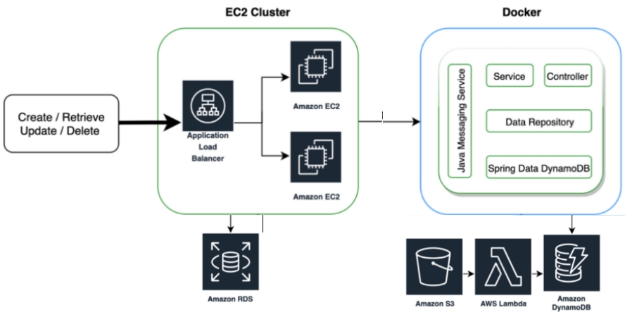

> ## APIs construídas no treinamento

1. [Exame](./requirements/examination.md)
2. [Laboratório](./requirements/laboratory.md)
3. [Associação](./requirements/association.md)

# Serviços a serem desenvolvidos:

**Modelos**

- Laboratório
  - nome
  - endereço
  - status [ativo, inativo]

- Exame
  - nome
  - tipo [analise clinica, imagem]
  - status [ativo, inativo]
  
**Funcionalidades:**

- Laboratório:
  - cadastrar um novo laboratório;
  - obter uma lista de laboratórios ativos;
  - atualizar um laboratório existente;
  - remover logicamente um laboratório ativo.
  - O cadastro de um laboratório é considerado ativo e recebe um `id` gerado automaticamente.
  - Possibilidade de executar cadastro, atualização e remoção em lote;

- Exames:
  - cadastrar um novo exame;
  - obter uma lista de exames ativos;
  - atualizar um exame existente;
  - remover logicamente um exame ativo.
  - Um exame pode estar associado a mais de um laboratório;
  - O cadastro de exame é considerado ativo e recebe um `id` gerado automaticamente.
  - associar um exame ativo à um laboratório ativo;
  - desassociar um exame ativo de um laboratório ativo;
  - Possibilidade de executar cadastro, atualização e remoção em lote;
  - Endpoint que faz a busca por nome do exame e retorna todos os laboratórios associados a esse exame.

# Amazon Web Services Architecture

# Instruções para utilização da API

- [GitHub](https://github.com/rhribeiro25/manageLabs): A aplicação pode ser executada facilmente como uma aplicação Spring Boot tradicional, na porta 9090, o banco de dados configurado é o MySQL contido no Amazon RDS.
- [Docker Hub](https://hub.docker.com/repository/docker/rhribeiro25/manage-labs): Como alternativa podemos executada facilmente a aplicação pela imagem Docker contida no Docker Hub, também na porta 9090, o banco de dados configurado é o MySQL contido no Amazon RDS.
- [Swagger UI](http://localhost:9090/swagger-ui.html): Após rodar a aplicação pode-se acessar a documentação Swagger para melhor esclarecimento das funcionalidades podendo ser realizado os testes pela própria ferramenta.
- [Postman Collections](src/main/resources/postmanCollection/manage-labs-postman-collections.json): Arquivo de coleção Postman para realizar o teste da API
- [exams-create](src/main/resources/files/csv/exams-create.csv): Arquivo para criação de Exames em lote.
- [exams-update](src/main/resources/files/csv/exams-update.csv): Arquivo para atualização de Exames em lote.
- [exams-delete](src/main/resources/files/csv/exams-delete.csv): Arquivo para remoção lógica de Exames em lote.
- [labs-create](src/main/resources/files/csv/labs-create.csv): Arquivo para criação de Laboratórios em lote.
- [labs-update](src/main/resources/files/csv/labs-update.csv): Arquivo para atualização de Laboratórios em lote.
- [labs-delete](src/main/resources/files/csv/labs-delete.csv): Arquivo para remoção lógica de Laboratórios em lote.

# Executando a API

- **Comando Docker:** $ docker run -it -p 9090:9090 rhribeiro25/manage-labs:1.0.3
- **Login:** admin
- **Password:** manageLabs@2020

“O dia que você acreditar ter atingido todo o seu potencial é o dia que não aconteceu. Por que você ainda tem o HOJE.” – Autor: Nick Vujicic

Obrigado...
