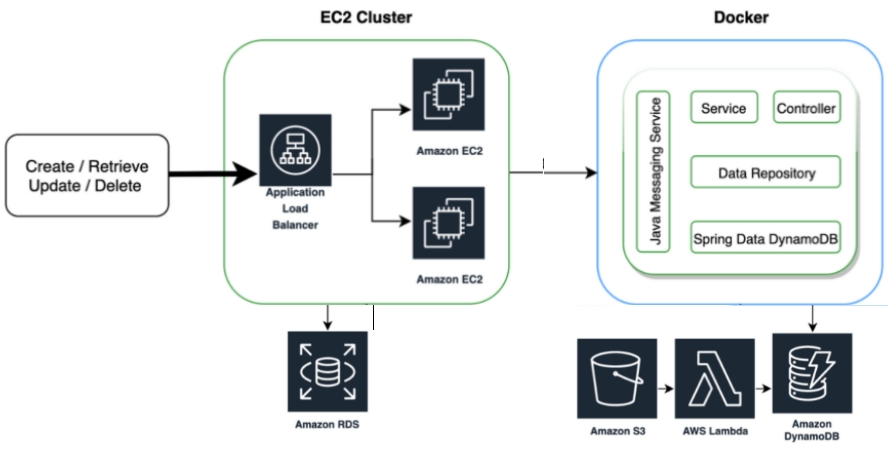

> # APIs construídas no treinamento

- [Exame](./documentation/examination.md)
- [Laboratório](./documentation/laboratory.md)
- [Associação](./documentation/association.md)

> # Credenciais admin para acesso as APIs

- **Login:** admin
- **Password:** manageLabs@2020

> # Configuração de Ambiente

- [Configuração de Ambiente](./documentation/environment-configuration.md)

> # Instruções de API

- [Configuração de Ambiente](./documentation/working-api.md)

> # Arquitetura do projeto

- [Configuração de Ambiente](./documentation/project-architecture.md)

> # Arquitetura do AWS

- [Configuração de Ambiente](./documentation/aws-architecture.md)

> # Instruções para utilização da API

- [GitHub](https://github.com/rhribeiro25/manageLabs): A aplicação pode ser executada facilmente como uma aplicação Spring Boot tradicional, na porta 9090, o banco de dados configurado é o MySQL contido no Amazon RDS.
- [Docker Hub](https://hub.docker.com/repository/docker/rhribeiro25/manage-labs): Como alternativa podemos executada facilmente a aplicação pela imagem Docker contida no Docker Hub, também na porta 9090, o banco de dados configurado é o MySQL contido no Amazon RDS.
- [Swagger UI](http://localhost:9090/swagger-ui.html): Após rodar a aplicação pode-se acessar a documentação Swagger para melhor esclarecimento das funcionalidades podendo ser realizado os testes pela própria ferramenta.
- [Postman Collections](src/main/resources/postmanCollection/manage-labs-postman-collections.json): Arquivo de coleção Postman para realizar o teste da API
- [exams-create](src/main/resources/files/csv/exams-create.csv): Arquivo para criação de Exames em lote.
- [exams-update](src/main/resources/files/csv/exams-update.csv): Arquivo para atualização de Exames em lote.
- [exams-delete](src/main/resources/files/csv/exams-delete.csv): Arquivo para remoção lógica de Exames em lote.
- [labs-create](src/main/resources/files/csv/labs-create.csv): Arquivo para criação de Laboratórios em lote.
- [labs-update](src/main/resources/files/csv/labs-update.csv): Arquivo para atualização de Laboratórios em lote.
- [labs-delete](src/main/resources/files/csv/labs-delete.csv): Arquivo para remoção lógica de Laboratórios em lote.

> # Proposta para Amazon Web Services Architecture

“O dia que você acreditar ter atingido todo o seu potencial é o dia que não aconteceu. Por que você ainda tem o HOJE.” – Autor: Nick Vujicic

